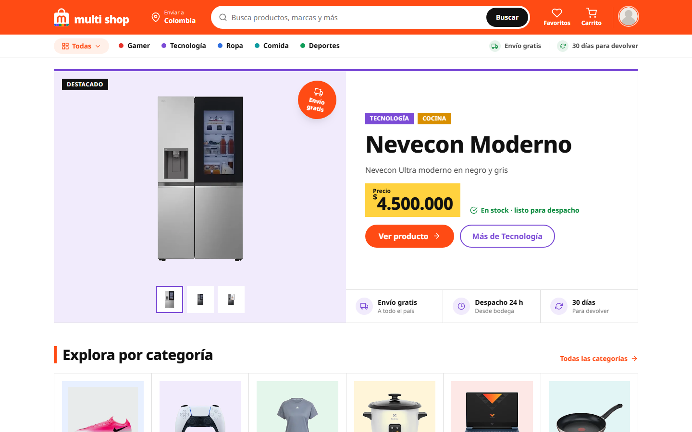
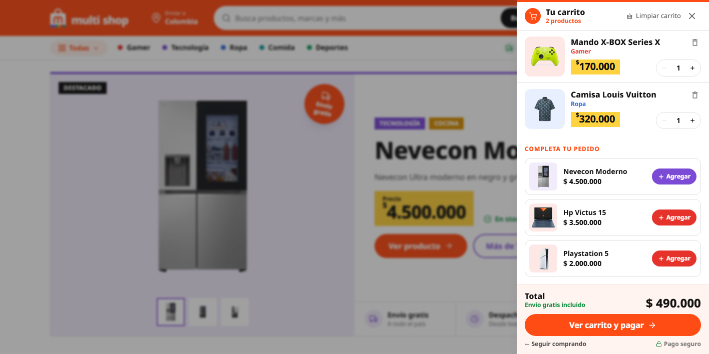
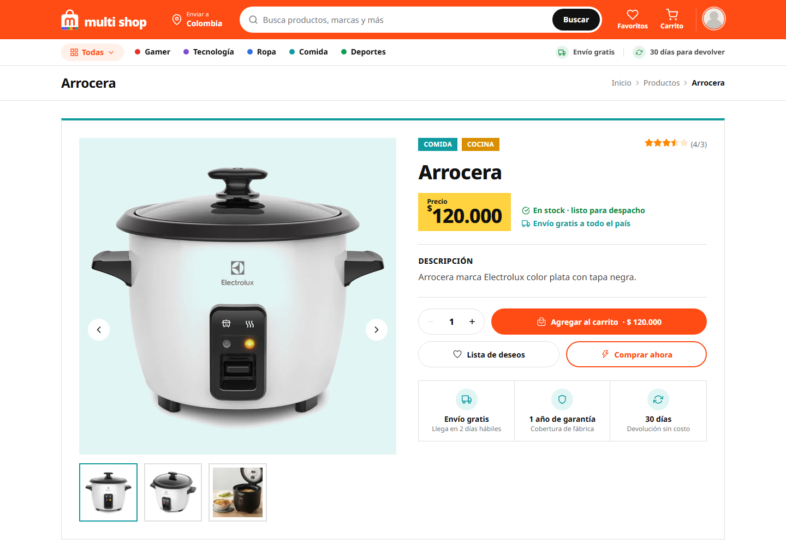
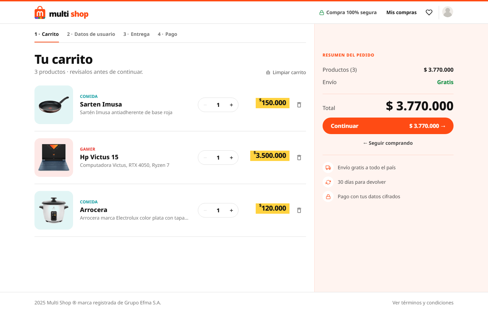
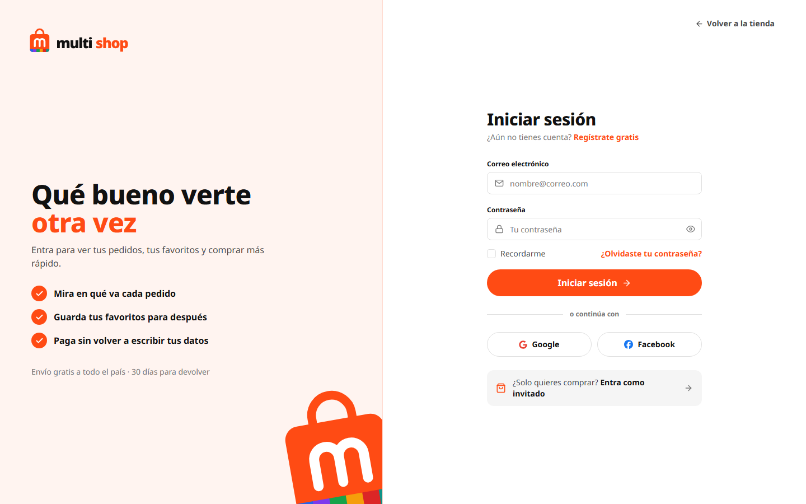

# Multi Shop

## Qué es

Multi Shop es una **tienda en línea de todo un poco**: ropa, tecnología, deportes, cocina, gamer y comida, en un solo lugar y con envío gratis a todo Colombia.

La idea es que comprar se sienta como hojear un **catálogo impreso**: productos ordenados por secciones, fotos grandes, precios que saltan a la vista y ningún paso de más entre "me gusta" y "ya lo pagué".

## Para quién es

Para quien quiere comprar rápido y con confianza, sin perderse entre menús:

| Quiere… | La tienda le da… |
|---|---|
| Encontrar algo rápido | Categorías siempre a la mano en la barra, cada una con su color, y un buscador grande |
| Saber cuánto cuesta sin buscar | Todos los precios en una **etiqueta amarilla** que se ve de lejos |
| Comprar sin miedo | Envío gratis, 30 días para devolver y pago seguro con Stripe, repetidos donde hace falta |
| No crear una cuenta | Puede comprar como invitado |
| Volver después | Una lista de deseos y sus datos guardados para la próxima compra |

## El recorrido de compra

1. **Descubre.** El inicio abre con el producto destacado y sigue con las categorías. Cada categoría tiene su propio carrusel, y entre ellos aparecen secciones que rompen la rutina: un producto estrella, promociones y cómo funciona la compra.
2. **Mira de cerca.** El detalle del producto muestra la galería de fotos, el precio, el stock, el envío y la garantía, todo en una sola vista.
3. **Guarda.** El carrito se abre de lado sin sacarte de la página, y sugiere productos para completar el pedido.
4. **Paga en cuatro pasos.** Carrito → tus datos → entrega → pago. El resumen del pedido acompaña cada paso.
5. **Listo.** Una página de confirmación con el número de pedido y lo que sigue. Si el pago se cancela, el carrito queda guardado para intentar de nuevo.

## El diseño

### Identidad

| Elemento | Cómo se usa |
|---|---|
| **Naranja Multi Shop** `#ff4b14` | El color de la marca: la barra superior, los botones principales ("Agregar al carrito", "Continuar", "Pagar") y los detalles que guían la mirada |
| **Amarillo de precios** `#ffd23f` | Solo para las etiquetas de precio, como en los catálogos impresos. Si algo es amarillo, es un precio |
| **Negro y blanco** | La base: fondos blancos, textos negros y líneas finas para separar |
| **Verde** | Solo para buenas noticias: envío gratis, en stock, pedido recibido |
| **Logo** | Una **bolsa de compras naranja con una "m"** y, en la base, una franja con **los seis colores de las categorías**: la tienda de todo un poco en un solo símbolo. Tiene versión para fondo blanco, naranja y oscuro, y la bolsa sola como ícono |
| **Tipografía** | Noto Sans, gruesa en títulos y precios para que se lean de un vistazo |

### Un color por categoría

Cada categoría tiene su color. Ese color aparece en el punto de la barra, en el fondo de las fotos, en los botones de las tarjetas y en los títulos de su sección. Así se sabe dónde está uno sin tener que leer.

| Categoría | Color |
|---|---|
| Ropa | Azul |
| Tecnología | Morado |
| Deportes | Verde |
| Cocina | Ámbar |
| Gamer | Rojo |
| Comida | Turquesa |

### Principios

| Principio | Qué significa en la tienda |
|---|---|
| **Como un catálogo** | Celdas con líneas finas, fotos sobre fondos de color suave y la etiqueta amarilla de precio. Ordenado y fácil de recorrer |
| **El producto primero** | Las fotos son grandes y el nombre va en negrita; la descripción larga queda para el detalle |
| **Confianza donde se decide** | El envío gratis, las devoluciones y el pago seguro aparecen justo al lado de los botones de compra, no escondidos en el pie de página |
| **Sin pasos de más** | El carrito se abre sin cambiar de página, los formularios piden solo lo necesario y los pasos de compra se pueden recorrer hacia atrás |
| **Todo con sentido** | Nada es decorativo por gusto: cada color dice algo (marca, precio, categoría o buena noticia) |

### Piezas que se repiten

| Pieza | Dónde aparece |
|---|---|
| **Etiqueta amarilla de precio** | Tarjetas, detalle, carrito, portada y destacados |
| **Tarjeta de producto** | Foto sobre el color de su categoría, nombre, etiqueta de precio y botón de carrito del mismo color |
| **Secciones intermedias** | Entre las categorías del inicio: un producto destacado a todo color, un par de promociones y los pasos para comprar |
| **Pantalla partida** | En los pasos de compra: a la izquierda lo que se completa, a la derecha el resumen sobre naranja suave |
| **Campos redondeados** | Todos los formularios usan el mismo campo, con borde naranja al escribir y el error en rojo con su ícono |

### Las pantallas

| Detalle de producto | Pasos de compra |
|---|---|
|  |  |

| Ingreso y registro |
|---|
|  |

### Cómo habla la tienda

- De **tú**, cercana y directa: "Tu carrito", "Completa tu pedido", "Qué bueno verte otra vez".
- Frases cortas que dicen lo que pasa: "No te hicimos ningún cobro", "Envío gratis incluido".
- En los botones, lo que va a pasar: "Agregar al carrito", "Continuar", "Reintentar el pago".

---

## Para correr el proyecto

Necesitas Node.js 20 o superior y la API de Multi Shop funcionando.

1. Instala las dependencias con `npm install`.
2. Crea un archivo `.env` con `VITE_API_DESARROLLO` y `VITE_API_PRODUCCION` (la dirección de la API) y `SESSION_SECRET` (una clave para la sesión).
3. Arranca con `npm run dev` y abre `http://localhost:5173`.

Está hecho con React, React Router, Vite y Tailwind CSS.
